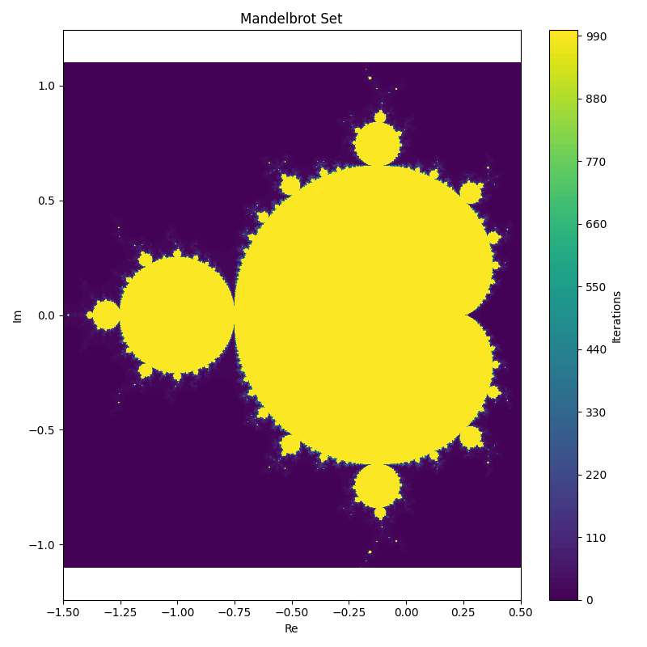

# Mandelbrot

The Mandelbrot set the the set of all complex numbers that does not diverges when starting with z = 0 and the next value is updated by the function f(z) = z^2 + c

## Installation

Create a Python virtual environment and install packages in _requirements.txt_
